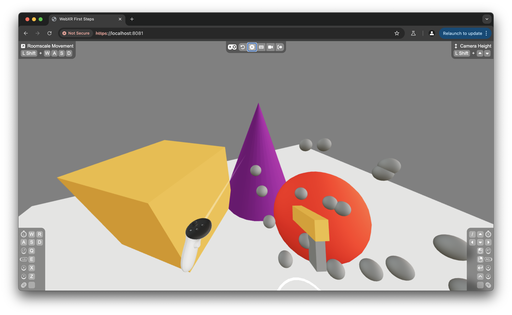

# Chapter 2: Spawning Bullets from Controller

In Chapter 2, we’ll focus on using VR controllers to interact with our WebXR scene. Specifically, you’ll learn to detect button presses and spawn a “bullet” from the gun component when the trigger is pressed.

## Setting Up Bullet State Management with Zustand

To manage our bullets as they are created, we’ll use Zustand, a lightweight state management library. Zustand allows us to store and manage application state, making it easier to track and update bullets in our scene.

### Defining Bullet Data

First, let’s define a `BulletData` type that outlines the basic structure for each bullet. Let's create a file named `bullets.tsx` and add the following to it:

```tsx
import { Quaternion, Vector3 } from "three";

type BulletData = {
  id: string;
  initPosition: Vector3;
  initQuaternion: Quaternion;
};
```

### Setting Up Bullet Store

With the `BulletData` type defined, we can now set up Zustand to store and manage bullets. This involves creating a store that holds an array of `bullets` and provides a function to add new bullets.

Add this to `bullets.tsx`:

```tsx
import { create } from "zustand";
import { generateUUID } from "three/src/math/MathUtils.js";

type BulletStore = {
  bullets: BulletData[];
  addBullet: (position: Vector3, quaternion: Quaternion) => void;
};

export const useBulletStore = create<BulletStore>((set) => ({
  bullets: [],
  addBullet: (position, quaternion) =>
    set((state) => {
      const newBullet = {
        id: generateUUID(),
        initPosition: position,
        initQuaternion: quaternion,
      };
      return { bullets: [...state.bullets, newBullet] };
    }),
}));
```

This code creates our Zustand store with:

- **`bullets`**: Initially an empty array.
- **`addBullet`**: Adds a new bullet to the store by generating a unique ID (`generateUUID`), setting its position and orientation, and appending it to the `bullets` array.

This setup allows us to manage bullets dynamically as they’re spawned in the scene.

## Rendering Bullets

To actually render the bullets in our scene, we’ll create two components:

### `Bullet` Component

The `Bullet` component defines the appearance and placement of a single bullet in the scene.

```tsx
type BulletProps = {
  bulletData: BulletData;
};

const Bullet = ({ bulletData }: BulletProps) => {
  return (
    <mesh
      position={bulletData.initPosition}
      quaternion={bulletData.initQuaternion}
    >
      <sphereGeometry args={[0.02]} />
      <meshStandardMaterial color="grey" />
    </mesh>
  );
};
```

- **Position and Orientation**: Sets the bullet’s position and rotation based on the initial values from `bulletData`.
- **Geometry and Material**: Renders the bullet as a small grey sphere.

### `Bullets` Component

Now that we have a `Bullet` component, we can create `Bullets` to render all bullets in the scene. This component retrieves the array of bullets from Zustand and renders a `Bullet` component for each one.

```tsx
export const Bullets = () => {
  const bullets = useBulletStore((state) => state.bullets);
  return (
    <>
      {bullets.map((bulletData) => (
        <Bullet bulletData={bulletData} key={bulletData.id} />
      ))}
    </>
  );
};
```

Finally, add `<Bullets />` inside `<Canvas>` in `index.tsx`, completing the rendering setup for bullets in the scene.

## Updating the Gun Component to Spawn Bullets

In `gun.tsx`, we’ll modify the `Gun` component to spawn a bullet whenever the trigger is pressed. We’ll break this into two steps: adding a reference to the barrel mesh and setting up the trigger event handling.

### Step 1: Adding a Reference to the Barrel Mesh

We’ll start by creating a reference to the main barrel mesh. This reference allows us to retrieve the barrel’s position and orientation when we need to spawn a bullet.

Replace `gun.tsx` with the following:

```tsx
import { useRef } from "react";

export const Gun = () => {
  // Reference for the barrel
  const barrelRef = useRef<Mesh>(null);

  return (
    <group rotation-x={-Math.PI / 8}>
      {/* Main barrel mesh with a reference */}
      <mesh ref={barrelRef}>
        <boxGeometry args={[0.035, 0.05, 0.16]} />
        <meshStandardMaterial color="orange" />
      </mesh>
      {/* Additional part of the gun model */}
      <mesh rotation-x={Math.PI / 2} position={[0, -0.05, 0.05]}>
        <boxGeometry args={[0.025, 0.04, 0.1]} />
        <meshStandardMaterial color="grey" />
      </mesh>
    </group>
  );
};
```

### Step 2: Handling Trigger Press Events

Now that we have a reference to the barrel, we can detect the controller’s trigger press and spawn a bullet at the barrel’s location.

Extend `gun.tsx` with the following code to handle the trigger press:

```tsx
import { Mesh, Quaternion, Vector3 } from "three";
import {
  useXRControllerButtonEvent,
  useXRInputSourceStateContext,
} from "@react-three/xr";
import { useBulletStore } from "./bullets";

export const Gun = () => {
  // ... unchanged code
  // Retrieve the state context for the controller
  const state = useXRInputSourceStateContext("controller");
  // Handle trigger press event to spawn a bullet
  useXRControllerButtonEvent(state, "xr-standard-trigger", (state) => {
    if (state === "pressed" && barrelRef.current) {
      useBulletStore
        .getState()
        .addBullet(
          barrelRef.current.getWorldPosition(new Vector3()),
          barrelRef.current.getWorldQuaternion(new Quaternion())
        );
    }
  });
  // ... unchanged code
};
```

- **Controller State**: The `useXRInputSourceStateContext("controller")` hook from @react-three/xr allows us to get the state of the current controller.
- **Listen to Trigger State**: The `useXRControllerButtonEvent` hook enables us to listen to the state changes of the `"xr-standard-trigger"` button. Once the state is equal to `"pressed"`, we spawn the bullet at the world position and rotation of the barrel.

## Summary

In this chapter, we added state management with Zustand to track bullets, created a `Bullets` component to render them, and updated the `Gun` component to spawn bullets when the trigger is pressed. This sets the stage for more complex interactions, like moving these bullets, which we’ll cover in the next chapter.

Here’s what our scene looks like after adding the bullet spawning feature:



[View full changes made in this chapter](https://github.com/meta-quest/webxr-first-steps-react/compare/chapter1...chapter2)
