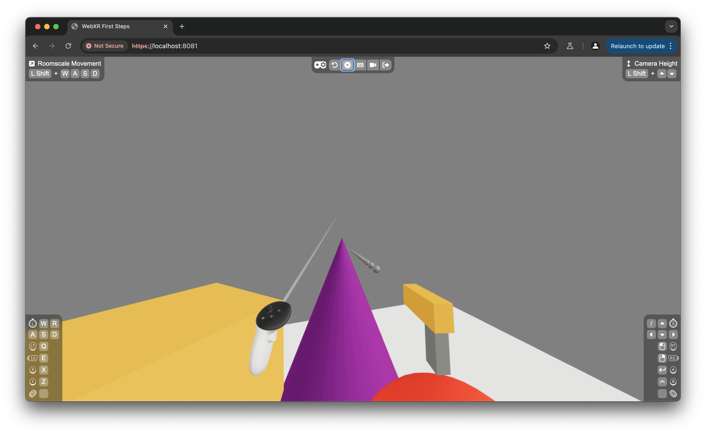

# Chapter 3: Animating Bullet Objects

In this chapter, we’ll make the bullets move forward in the direction they face when spawned, and disappear after a set time. This involves managing each bullet’s movement and lifespan to ensure they don’t remain in the scene indefinitely.

## Constants for Bullet Behavior

First, we define some constants to control bullet speed and lifespan. These can be added at the top of `bullets.tsx`:

```tsx
const bulletSpeed = 10;
const forwardVector = new Vector3(0, 0, -1);
const bulletTimeToLive = 2;
```

- **`bulletSpeed`**: Sets the speed of bullets, here set to 10 units per second.
- **`forwardVector`**: This vector points forward along the negative Z-axis, representing the default direction bullets will move.
- **`bulletTimeToLive`**: Defines how long each bullet stays in the scene before being removed (2 seconds in this example).

## Extending Zustand for Bullet Lifespan

Next, let’s update the Zustand store in `bullets.tsx` to remove bullets after their lifespan ends. We’ll add a `removeBullet` function and update `addBullet` to automatically call it after `bulletTimeToLive`.

```tsx
type BulletData = {
  id: string;
  initPosition: Vector3;
  initQuaternion: Quaternion;
  timestamp: number;
};

type BulletStore = {
  bullets: BulletData[];
  addBullet: (position: Vector3, quaternion: Quaternion) => void;
  removeBullet: (bulletId: string) => void;
};

export const useBulletStore = create<BulletStore>((set) => ({
  bullets: [],
  addBullet: (position, quaternion) =>
    set((state) => {
      const newBullet = {
        id: generateUUID(),
        initPosition: position,
        initQuaternion: quaternion,
        timestamp: performance.now(),
      };
      setTimeout(() => {
        state.removeBullet(newBullet.id);
      }, bulletTimeToLive * 1000);
      return { bullets: [...state.bullets, newBullet] };
    }),
  removeBullet: (bulletId) =>
    set((state) => ({
      bullets: state.bullets.filter((bullet) => bullet.id !== bulletId),
    })),
}));
```

- **`timestamp`**: Records the time when the bullet is created. This helps calculate its position over time.
- **`removeBullet`**: Filters out the bullet with a matching `id` from the store, removing it.
- **`setTimeout`**: Automatically removes the bullet after `bulletTimeToLive` seconds, keeping the scene clean and efficient.

## Updating Bullet Position Over Time

To animate each bullet, we’ll use the `useFrame` hook from `@react-three/fiber`. The `useFrame` hook is part of the **frameloop** in React Three Fiber, which runs continuously on every frame to update the scene. By using `useFrame`, we can update the position of each bullet in real-time, making them move smoothly forward.

### Bullet Component

In the `Bullet` component, we add `useFrame` to update each bullet’s position based on its speed and direction. Here’s the updated code:

```tsx
import { Mesh, Vector3 } from "three";
import { useFrame } from "@react-three/fiber";
import { useRef } from "react";

type BulletProps = {
  bulletData: BulletData;
};

const Bullet = ({ bulletData }: BulletProps) => {
  const ref = useRef<Mesh>(null);

  useFrame(() => {
    const now = performance.now();
    const bulletObject = ref.current!;
    const directionVector = forwardVector
      .clone()
      .applyQuaternion(bulletObject.quaternion);
    bulletObject.position.addVectors(
      bulletData.initPosition,
      directionVector.multiplyScalar(
        (bulletSpeed * (now - bulletData.timestamp)) / 1000
      )
    );
  });

  return (
    <mesh ref={ref} quaternion={bulletData.initQuaternion}>
      <sphereGeometry args={[0.02]} />
      <meshStandardMaterial color="grey" />
    </mesh>
  );
};
```

Let's break this down:

- **`useFrame` Hook**: Runs each frame, updating the bullet’s position to move it forward over time.
- **Direction Calculation**: We apply the bullet’s initial quaternion to the `forwardVector`, aligning its movement with the orientation of the gun when it was fired.
- **Position Update**: The bullet’s position is updated to the sum of the initial position and the direction vector multiplied by the `bulletSpeed` and the time passed since the bullet was spawned. This creates a consistent forward motion.

## Summary

In this chapter, we've enhanced our WebXR experience by animating the bullets. Now, when fired, the bullets travel in the direction the controller is pointing and disappear after a set time. This addition introduces dynamic motion to your scene and maintains performance by removing bullets after they’re no longer needed.

Here’s what our scene looks like with the bullet animation feature:



[View full changes made in this chapter](https://github.com/meta-quest/webxr-first-steps-react/compare/chapter2...chapter3)
